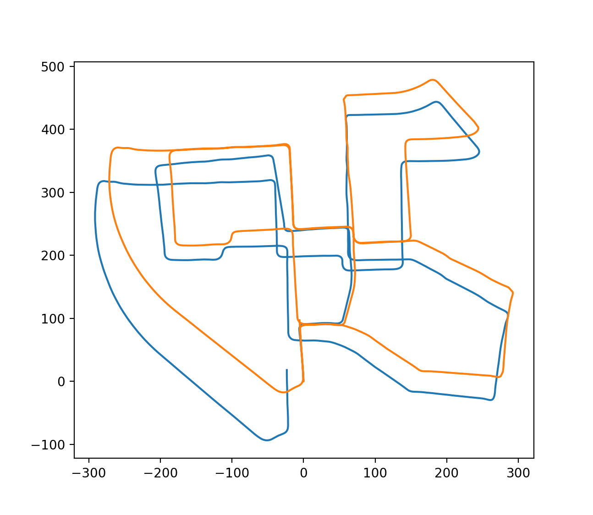
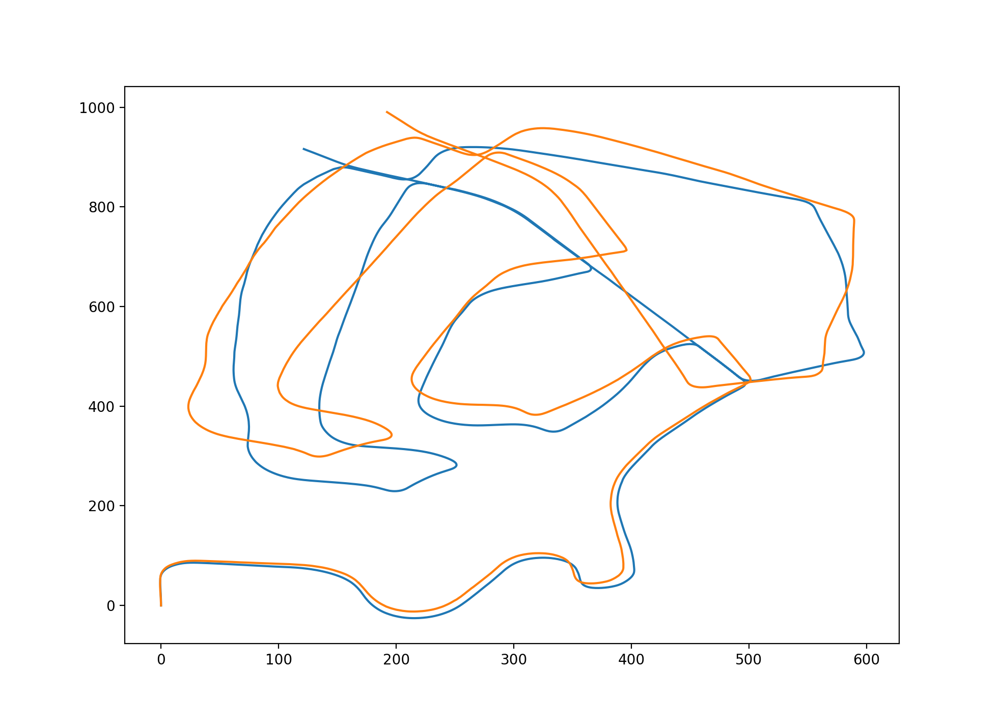

# MVOScaleRecovery
Recover the scale of monocular visual odometry

# RUN
1. save your image name in path\_to\_image\_list by `find path/| sort >path_to_image_list`
2. run
`python3 src/main.py path_to_image_list`

# Note
this is a scale recoery for a simple monocular VO, the accuracy is degraded. 

Current result

